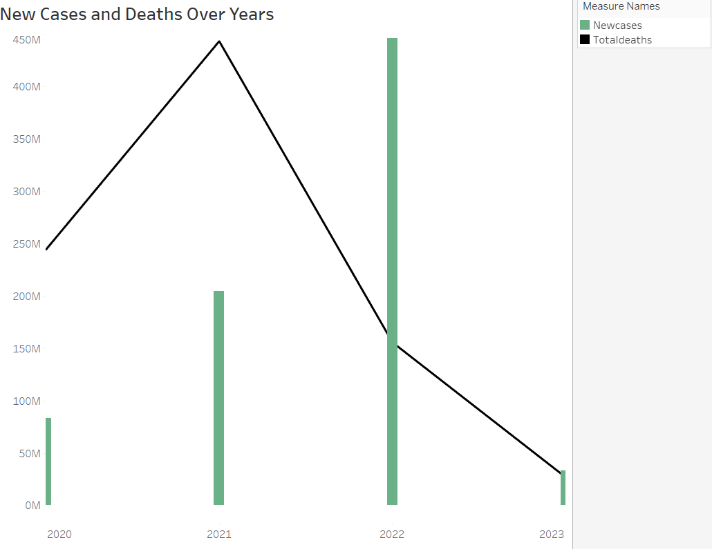

# Recent-Trend-in-COVID-19
Analysis to show the recent trends in COVID-19 data from 2020 to 2023

## Introduction
This is an exploratory analysis on COVID using SQL AND Tableau. The data was extracted from our world in data website.

## Project Objective
To analyse the recent trend in COVID-19 across the world, countries with highest number of new cases and deaths in the first quarter of 2023. 

## Data Sourcing
Data was scraped from the web into excel.
Two tables depicting the global population, number of new cases, vaccination and deaths were scraped from [here](https://ourworldindata.org/covid-deaths)

## Analysis
Analysis was done using SQL
Queries were written to derive the following:
1.	Total new cases om 2023
2.	Total confirmed death in 2023
3.	Countries with highest number of deaths and new cases in 2023
4.	Countries with highest number of vaccinated people
5.	A forecast of new cases and new deaths for year 2024 and 2025

Tables created were copied and saved into excel and imported in Tableau to create the visualizations.

## Findings
The analysis showed a decline in new cases and death in the first quarter of 2023 while countries like China, United States and Japan are topping list. The forecast shows an increase the number of new cases and deaths for the next two years. The Total world death percentage has also declined from 2.3% in 2020 to 0.65 in 2023.

## Conclusion
Number of new cases and death of COVID-19 has declined, but still prevalent in some countries. It is worthy to note that there is high number of vaccinated citizens in those countries where is it still prevalent 👍. However, forecast shows an increase in the number of new cases the next over two years.
